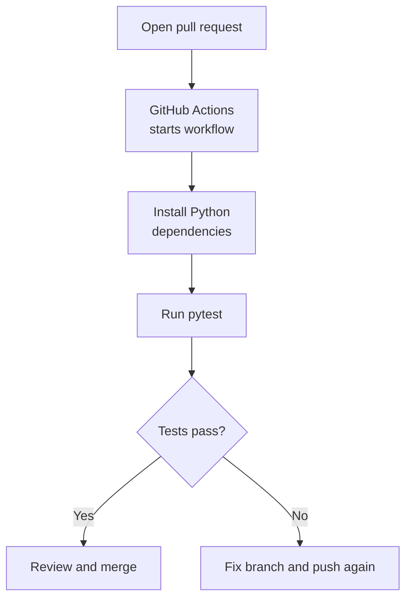
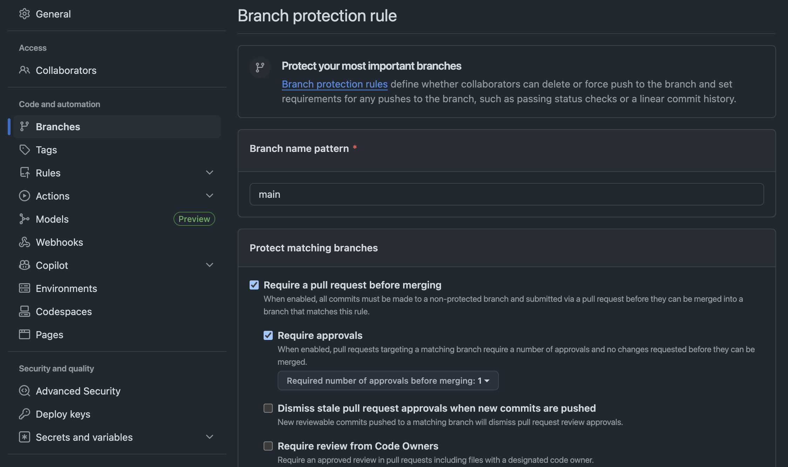
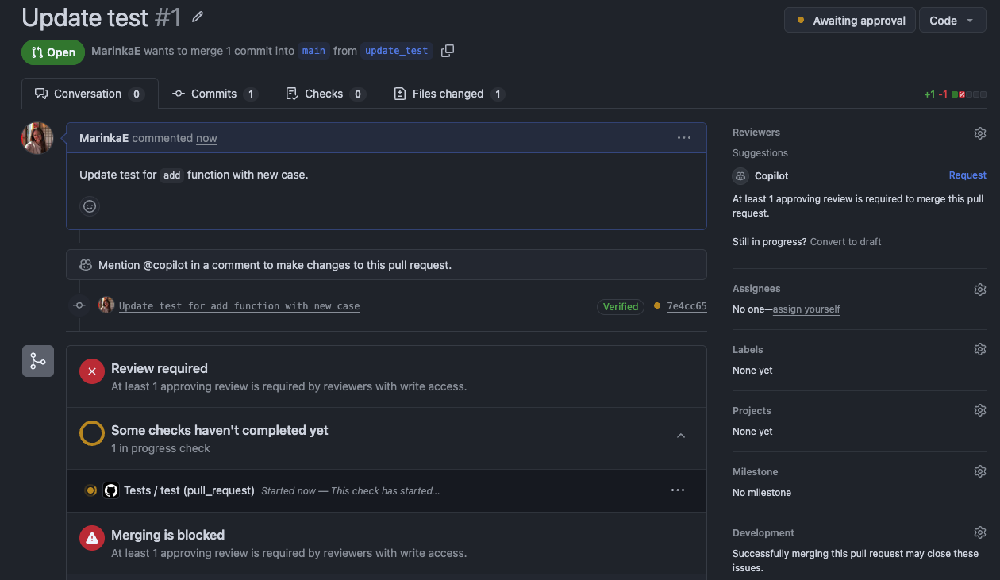

# GitHub Actions

GitHub Actions is GitHub's built-in automation platform. In ML projects, you can use it to run tests before merging code, check formatting, build containers, pull versioned data, or trigger model-training jobs.

In this first lesson, you will create a small pull request workflow. The example is intentionally simple: start with a Python function and a pytest check, then require that check before code can merge into `main`.

## Workflow



## Create a test workflow

1. Create a new repository on GitHub.

2. Create a `requirements.txt` file with pytest:

   ```text
   pytest
   ```

3. Create `src/calculator.py`:

   ```python
   def add(a, b):
       return a + b
   ```

4. Create `tests/test_calculator.py`:

   ```python
   from src.calculator import add


   def test_add():
       assert add(1, 2) == 3
       assert add(-2, 2) == 0
       assert add(0, 0) == 0
   ```

5. Create `.github/workflows/test.yaml`:

   ```yaml
   name: Tests

   on:
     pull_request:
       branches:
         - main

   permissions:
     contents: read

   jobs:
     test:
       runs-on: ubuntu-latest
       timeout-minutes: 10
       steps:
         - uses: actions/checkout@v6

         - name: Set up Python
           uses: actions/setup-python@v6
           with:
             python-version: "3.11.3"

         - name: Install dependencies
           run: |
             python -m pip install --upgrade pip
             python -m pip install -r requirements.txt

         - name: Run tests
           run: python -m pytest
   ```

6. Push these starter files to `main`.

7. Go to **Settings > Branches > Add classic branch protection rule** and set:

   - Branch name pattern: `main`
   - Require a pull request before merging: Check
   - Require approvals: Check
   - Require status checks to pass before merging: Check

    Then click on **Create**.



8. Create a new branch, change the calculator or test, commit, and open a pull request into `main`. You should see the workflow start automatically.



## Interpret the result

The pull request check is a feedback gate. A passing check means the repository can recreate the test environment and run the test suite from scratch. A failing check means the branch needs another commit before it is ready to merge.

The starter workflow only asks for `contents: read` because it only needs to check out the repository and run tests. Later, the CML workflow asks for write permissions because it needs to publish a pull request comment.

The `timeout-minutes` setting is a small safety guard: if a dependency install or test run gets stuck, GitHub stops the job instead of letting it run until the repository limit is reached.

In a larger ML repo, this same pattern can run data validation, linting, model smoke tests, or training jobs. Later lessons extend this workflow with DVC and CML.

## Exercise

- Add a `subtract(a, b)` function and a matching pytest test.
- Push the branch and confirm the workflow runs again.
- Break one assertion on purpose, observe the failure, then fix it with a new commit.
