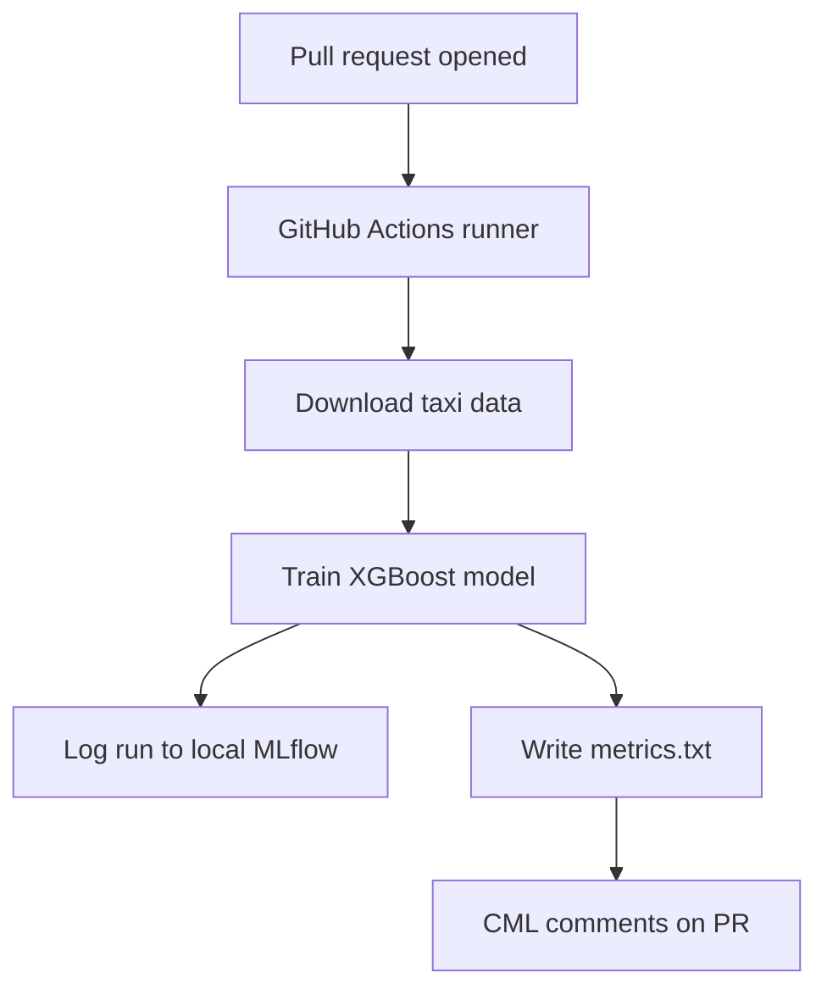

# CI/CD Workflow with CML

Continuous integration asks: "Can this change be merged safely?". In machine learning, that question includes code, data access, training behavior and metrics. [CML](https://cml.dev/) lets a GitHub Actions workflow post model results directly on a pull request so reviewers can inspect them before merging.

## CI/CD in Machine Learning

Traditional CI often checks code only: install dependencies, run tests, and build the application. ML CI/CD usually has extra moving parts:

- Data can change independently from code.
- Training jobs need a repeatable way to fetch or recreate data.
- Model quality must be evaluated with metrics, not just successful execution.
- Experiment results should be visible to reviewers.

This repository combines DVC, MLflow and CML to demonstrate that pattern.



## Training script

[`src/train.py`](src/train.py) trains an XGBoost regressor on the Green Taxi Trip dataset. It:

- calculates trip duration from pickup and dropoff timestamps,
- keeps trips between 1 and 60 minutes,
- builds route and distance features,
- trains a `DictVectorizer` plus `XGBRegressor` pipeline,
- logs train and test RMSE to MLflow,
- writes `metrics.txt` when run with `--cml-run`.

Run it locally after downloading the data and configuring MLflow:

`macOS` / `Linux` / `Git Bash`:

```bash
export MLFLOW_TRACKING_URI="sqlite:///mlflow.db"
python src/train.py --cml-run
cat metrics.txt
```

`PowerShell`:

```powershell
$env:MLFLOW_TRACKING_URI="sqlite:///mlflow.db"
python src/train.py --cml-run
Get-Content metrics.txt
```

The local clean run should produce a `metrics.txt` file shaped like this:

```text
# Training Metrics

- RMSE on the train set: 4.7306
- RMSE on the test set: 5.0584
- Rows after filtering: 46307
```

The exact values can move slightly across library versions, but the train and test RMSE should be in the same range. A much lower train RMSE than test RMSE is a sign that the model may be overfitting. The row count confirms how many trips remained after filtering out trips shorter than 1 minute or longer than 60 minutes.

## GitHub Actions workflow

This repository includes [`.github/workflows/cml.yaml`](.github/workflows/cml.yaml). The workflow runs on pull requests to `main`, downloads the data, trains the model, and posts the metrics back to the pull request.

```yaml
name: CML

on:
  pull_request:
    branches:
      - main

permissions:
  contents: read
  issues: write
  pull-requests: write

jobs:
  train-and-report:
    runs-on: ubuntu-latest
    timeout-minutes: 15
    steps:
      - uses: actions/checkout@v6

      - uses: actions/setup-python@v6
        with:
          python-version: "3.11.3"

      - uses: iterative/setup-cml@v2.0.1

      - name: Install dependencies
        run: |
          python -m pip install --upgrade pip
          python -m pip install -r requirements.txt

      - name: Download taxi data
        run: |
          mkdir -p data
          curl -L --fail -o data/green_tripdata_2025-01.parquet \
            https://d37ci6vzurychx.cloudfront.net/trip-data/green_tripdata_2025-01.parquet

      - name: Train model
        env:
          MLFLOW_TRACKING_URI: sqlite:///mlflow.db
        run: |
          python src/train.py --cml-run

      - name: Publish CML report
        env:
          REPO_TOKEN: ${{ secrets.GITHUB_TOKEN }}
        run: |
          cat metrics.txt >> report.md
          cml comment create report.md
```

The workflow uses the built-in `GITHUB_TOKEN` through `REPO_TOKEN`, which CML uses to post the pull request comment. You do not need to configure extra credentials.

The `permissions` block keeps the token scoped to what this exercise needs: read the repository contents and write the CML report back to the pull request.

The workflow uses separate named steps for dependency installation, data download, training, and reporting. That makes failures easier to locate in the GitHub Actions log.

The `timeout-minutes` setting keeps the pull request check bounded. If the data download, dependency installation, or training step hangs, GitHub stops the job and surfaces the failure in the pull request.

The workflow intentionally downloads the small monthly dataset during each pull request run. This keeps the exercise self-contained and avoids external data infrastructure configuration.

## Interpret the CML report

The report is useful because it moves model feedback into the same place where code review happens. Reviewers should look for whether:

- the workflow completed without download or training errors,
- train and test RMSE are close enough to avoid obvious overfitting,
- metric changes are expected for the branch,
- the branch changed code, data metadata, or both.

## Exercise

- Open a pull request that changes one training parameter, then compare the CML comment with the previous run.
- Add one more metric to `metrics.txt`, such as the number of rows before filtering.
- Temporarily change the data URL and read the workflow failure message, then restore it.
