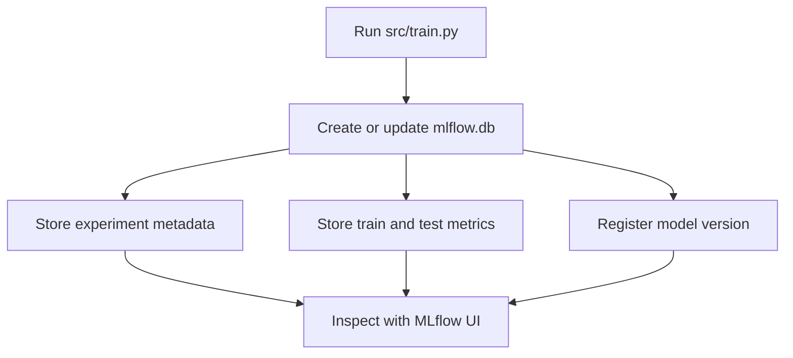

# MLflow Model Tracking

MLflow records what happened during a training run: parameters, metrics, tags, and model artifacts. In this repository, MLflow runs locally with a SQLite database, so you can inspect model tracking without setting up any external service.

## Local tracking workflow



## Run a tracked training job

If you have not done it already in step `03`, set the MLflow tracking URI to a local SQLite database and then run the training script:

`macOS` / `Linux` / `Git Bash`:

```bash
export MLFLOW_TRACKING_URI="sqlite:///mlflow.db"
python src/train.py --cml-run
```

`PowerShell`:

```powershell
$env:MLFLOW_TRACKING_URI = "sqlite:///mlflow.db"
python src/train.py --cml-run
```

The command trains the model, writes `metrics.txt`, and stores the MLflow run in `mlflow.db`.

## Open the MLflow UI

Start the local UI:

```bash
mlflow ui --backend-store-uri sqlite:///mlflow.db
```

Open the URL printed by MLflow, usually <http://127.0.0.1:5000>.

If port `5000` is already in use, choose another local port:

```bash
mlflow ui --backend-store-uri sqlite:///mlflow.db --port 5001
```

In the UI, inspect:

- the `green-taxi-trip-duration-xgb` experiment,
- the latest run,
- the `rmse_train`, `rmse_test` and `rows_after_filtering` metrics,
- the run tags describing the dataset, target and feature set,
- the registered model named `green-taxi-trip-duration-xgb`.

## What to look for

| Signal | Healthy result | Possible issue |
| --- | --- | --- |
| `rmse_train` and `rmse_test` | Values are close to each other. | Test error is much higher, suggesting overfitting. |
| `rows_after_filtering` | Matches the expected filtered row count for the dataset and filters used. | Data file, filters, or input month may have changed. |
| Model version | A new version appears after each tracked run. | MLflow registry did not receive the logged model. |
| Tags | Dataset, target and feature information are present. | The run is harder to interpret during review. |

## Compare two runs

Change one small training setting, such as `n_estimators`, then open a new terminal and rerun the training script:

`macOS` / `Linux` / `Git Bash`:

```bash
export MLFLOW_TRACKING_URI="sqlite:///mlflow.db"
python src/train.py --cml-run
```

`PowerShell`:

```powershell
$env:MLFLOW_TRACKING_URI = "sqlite:///mlflow.db"
python src/train.py --cml-run
```

Refresh the MLflow UI and compare the two latest runs. The goal is not to chase the best metric immediately, but to practice connecting a code change to a tracked result.

You can stop the UI in the running terminal with `Ctrl + C` when you are done.

## Generated files

MLflow creates local artifacts that should stay out of Git:

| Path | Purpose |
| --- | --- |
| `mlflow.db` | SQLite database for local experiment tracking and model registry metadata. |
| `mlflow.db-shm` and `mlflow.db-wal` | SQLite helper files that can appear while the database is active. |
| `mlruns/` | Local file-based artifact directory used by MLflow for run artifacts. |
| `mlartifacts/` | Local artifact-serving directory that can appear when using the MLflow UI. |
| `metrics.txt` | Short CML-ready metrics report produced by `--cml-run`. |

These files are ignored because they are generated outputs. Commit code, workflow files, and documentation; do not commit local tracking databases.
