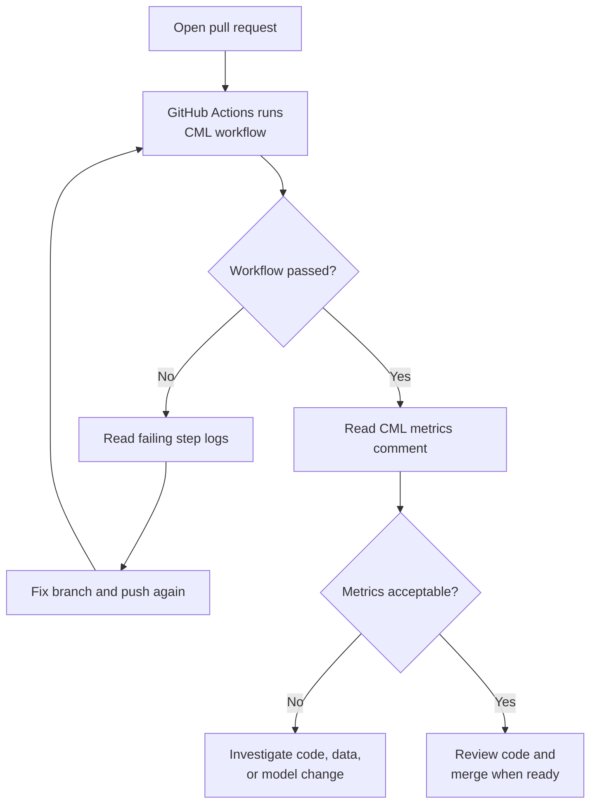
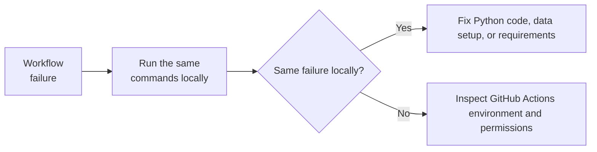

# CI Review and Troubleshooting

A CI workflow is only useful if reviewers know how to read it. This lesson focuses on the review step: inspect a pull request, understand a CML metrics comment, and debug common failures without guessing.

Use this after you have opened a pull request in step `03` that runs the CML workflow.

## Review workflow



## Start with the pull request

In the pull request, check these areas in order:

1. **Conversation**: Look for the CML metrics comment.
2. **Checks**: Confirm the CML workflow passed.
3. **Files changed**: Connect metric changes to code, workflow, or documentation changes.
4. **Commits**: Confirm fixes were added as new commits instead of rewriting context during review.

This order keeps the review grounded: first confirm the automation result, then inspect the diff that produced it.

## Read the CML comment

The expected report is short:

```text
# Training Metrics

- RMSE on the train set: 4.7306
- RMSE on the test set: 5.0584
- Rows after filtering: 46307
```

Use the comment as a review signal:

| Question | Why it matters |
| --- | --- |
| Did the workflow finish? | A missing CML comment usually means the workflow failed before reporting. |
| Are train and test RMSE close? | A large gap can point to overfitting or a data split issue. |
| Did the row count change? | A changed count can reveal a data URL, filtering, or preprocessing change. |
| Does the metric change match the diff? | A model-code change should explain a metric movement. A docs-only change should not. |

## Debug common failures

| Symptom | Where to look first | Likely fix |
| --- | --- | --- |
| Data download fails | `Download taxi data` step | Check the URL and rerun the workflow. |
| Dependency install fails | `Install dependencies` step | Fix the pinned package version or Python compatibility. |
| Training fails with missing data | `Train model` step | Confirm the workflow downloads the parquet before running `src/train.py`. |
| CML does not comment | `Publish CML report` step | Check `REPO_TOKEN` and workflow `permissions`. |
| Metrics look unexpectedly different | CML comment and `src/train.py` diff | Review preprocessing, features, model settings, and data month. |

## Local reproduction



When a workflow fails, reproduce the same core steps locally before changing the workflow:

`macOS` / `Linux` / `Git Bash`:

```bash
python -m pip install -r requirements.txt
mkdir -p data
curl -L --fail -o data/green_tripdata_2025-01.parquet \
  https://d37ci6vzurychx.cloudfront.net/trip-data/green_tripdata_2025-01.parquet
export MLFLOW_TRACKING_URI="sqlite:///mlflow.db"
python src/train.py --cml-run
cat metrics.txt
```

`PowerShell`:

```powershell
python -m pip install -r requirements.txt
New-Item -ItemType Directory -Force data
curl.exe -L --fail -o data\green_tripdata_2025-01.parquet `
  https://d37ci6vzurychx.cloudfront.net/trip-data/green_tripdata_2025-01.parquet
$env:MLFLOW_TRACKING_URI="sqlite:///mlflow.db"
python src/train.py --cml-run
Get-Content metrics.txt
```

If the local command fails the same way, fix the Python code or dependency setup first. If the local command works but GitHub Actions fails, inspect the workflow environment, permissions, and shell commands.

## Decide whether to merge

A passing workflow is not the same as a good change. Use this decision table:

| Situation | Review decision |
| --- | --- |
| Workflow fails | Do not merge. Read logs and fix the branch. |
| Workflow passes and metrics are stable | Continue with normal code review. |
| Workflow passes but test RMSE increases | Ask whether the change explains the metric movement. |
| Workflow passes but row count changes | Confirm the data source or filter change was intentional. |
| Docs-only PR changes metrics | Investigate. Documentation changes should not retrain differently. |
