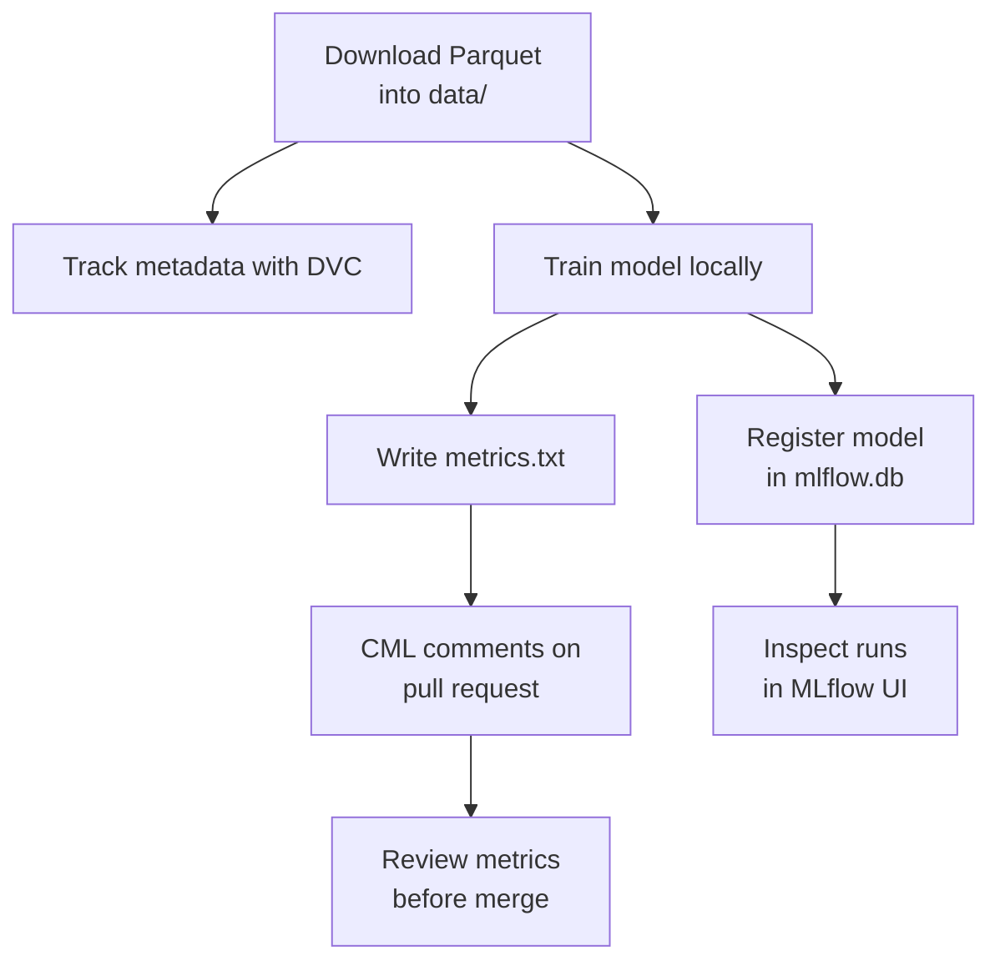

# GitHub Actions and CI/CD for Machine Learning

This repository shows how GitHub Actions, DVC and CML fit into a small machine learning CI/CD workflow. The goal is to help you move from a simple pull request test to a reproducible ML workflow that tracks data with DVC, trains a model, and publishes metrics back to a pull request.

## Learning Path

| Step | File | What you practice |
| --- | --- | --- |
| 1 | [01-intro-github-actions.md](01-intro-github-actions.md) | Create a pull request workflow, run tests and protect `main`. |
| 2 | [02-intro-to-dvc.md](02-intro-to-dvc.md) | Track a Green Taxi Parquet file with DVC and push it to a local DVC remote. |
| 3 | [03-cicd-workflow-with-cml.md](03-cicd-workflow-with-cml.md) | Download data inside GitHub Actions, train the model and post metrics with CML. |
| 4 | [04-mlflow-model-tracking.md](04-mlflow-model-tracking.md) | Inspect local MLflow experiments, metrics, tags, and registered model versions. |
| 5 | [05-ci-review-and-troubleshooting.md](05-ci-review-and-troubleshooting.md) | Read CI logs, interpret CML comments, and decide whether a model change is merge-ready. |

## Local-First

This repository is designed to run locally. The main path needs only:

- a Python virtual environment,
- the January 2025 Green Taxi Parquet file downloaded into `data/`,
- a local SQLite-backed MLflow store,
- an optional local DVC remote directory when practicing DVC.



## Environment

Please make sure you **use this repository as a template** and set up a new virtual environment. You can use the following commands:

### **`macOS`** / **`Linux`**

```bash
pyenv local 3.11.3
python -m venv .venv
source .venv/bin/activate
python -m pip install --upgrade pip
python -m pip install -r requirements.txt
```

### **`Windows`**

For `Git Bash` CLI:

```bash
pyenv local 3.11.3
python -m venv .venv
source .venv/Scripts/activate
python -m pip install --upgrade pip
python -m pip install -r requirements.txt
```

For `PowerShell` CLI:

```PowerShell
pyenv local 3.11.3
python -m venv .venv
.venv\Scripts\Activate.ps1
python -m pip install --upgrade pip
python -m pip install -r requirements.txt
```

## Setup

On macOS, XGBoost also needs the OpenMP runtime:

```bash
brew install libomp
```

## Learning Objectives

By the end of this repository, you should be able to:

- Create a GitHub Actions workflow that runs on pull requests.
- Protect `main` with review and status check requirements.
- Use DVC metadata to version a large ML dataset without committing the data file.
- Connect DVC to a local remote directory.
- Run a CML workflow that trains a model and comments metrics on a pull request.
- Inspect local MLflow runs, metrics, tags, and registered model versions.
- Troubleshoot failed CI runs and decide whether metric changes are merge-ready.
